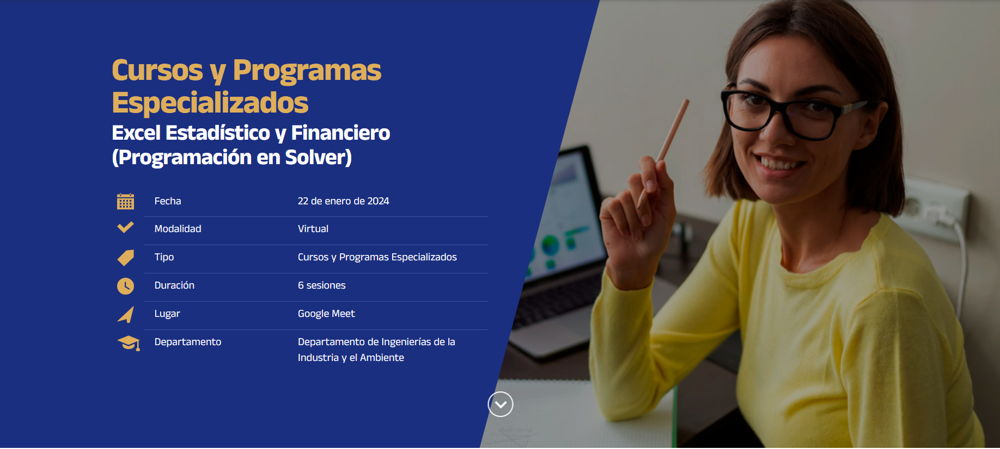
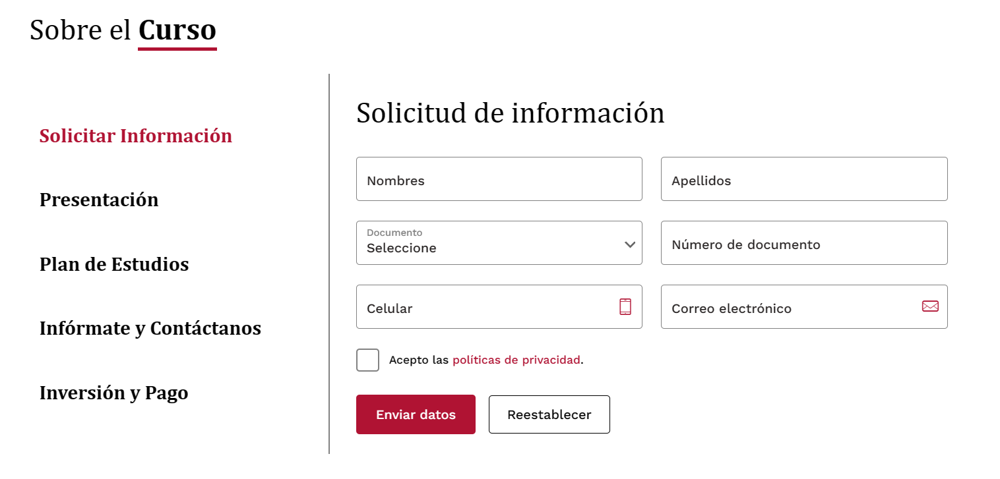

# Courses-FrontEnd
página perteneciente a los cursos

## Página de Contenedor de Cursos
usar la página de Cayetano
https://e.cayetano.edu.pe/programas/?tipo=cursos&estado=en-convocatoria

## Página de un curso en concreto
user la combinación de página de UCSP y Cayetano
#### Página específica de header de cursos
https://postgrado.ucsp.edu.pe/cursos/excel-estadistico-financiero-programacion-solver/

#### Página de contenido de curso
https://e.cayetano.edu.pe/programas/soporte-vital-de-trauma-prehospitalario-para-primer-respondiente-phtls-fr/

##Página de Inicio
usar la página de Cayetano
https://e.cayetano.edu.pe/programas/?tipo=cursos&estado=en-convocatoria
